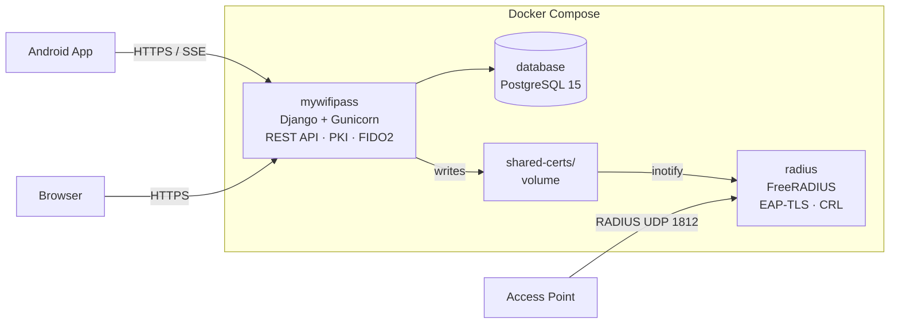

# MyWifiPass System


Server-side platform for managing Wi-Fi networks with **EAP-TLS** authentication. Handles the full X.509 certificate lifecycle - generation, signing, distribution, and revocation - with FreeRADIUS kept in sync via inotify.

---

## Architecture



---

## Features

- **Full PKI automation** - generates CAs and signs client certificates on the server; private keys stay on-device (JCE RSA-2048 via the Android app)
- **Identity validation** - before a certificate is signed, a user must be authorized either by a validator (event staff who checks the user's ID via the Android app) or by the user themselves via FIDO2/Passkey biometric authentication
- **Instant RADIUS sync** - inotify watcher in the RADIUS container picks up new SSIDs and certificate changes in seconds
- **Network & user management** - Django admin panel, web self-registration, CSV bulk import, mass email with inline QR codes
- **Authorization streaming** - SSE endpoint lets the Android app wait for authorization in real time (< 2s)
- **REST API** - fully documented (Swagger / ReDoc), token + session auth, rate limiting, nested routing

---

## Quick Start

```bash
git clone https://github.com/Pablodiz/mywifipass_system.git
cd mywifipass_system
cp .env.example .env
# Edit .env: set DB_PASS, SECRET_KEY, DOMAIN, and email credentials
docker compose up -d
```

Admin panel: `http://<DOMAIN>/admin/` - default credentials `admin` / `admin`, **change immediately**.

> Full setup details in the [Installation Guide](docs/installation.md). All environment variables documented in [Configuration](docs/configuration.md).

---

## Documentation

| Document | Content |
|---|---|
| [Architecture](docs/architecture.md) | Component diagrams, EAP-TLS & FIDO2 flows, database schema |
| [Installation](docs/installation.md) | Docker Compose deployment, manual dev setup |
| [Configuration](docs/configuration.md) | Complete `.env` reference, SMTP, FIDO2, SSL |
| [Usage Guide](docs/usage.md) | Admin panel, CSV import, QR codes, email delivery, FIDO2 |
| [API Reference](docs/api-reference.md) | 20+ endpoints, auth, SSE streaming, rate limits |
| [FIDO2 Guide](docs/fido2-guide.md) | Passkey registration/authentication, discoverable vs email mode |
| [RADIUS Integration](docs/radius-integration.md) | File-system sync, shell scripts, CRL automation |
| [Security Model](docs/security.md) | Certificate lifecycle, symmetric key protection, threat model |
| [Development](docs/development.md) | Local setup, testing, debugging, CI/CD |
| [Project Structure](docs/project-structure.md) | Directory tree with explanations |
| [Troubleshooting](docs/troubleshooting.md) | Common issues: containers, RADIUS, certificates, FIDO2 |
| [Contributing](docs/contributing.md) | PR rules, code style, commit conventions |
| [Changelog](docs/changelog.md) | Version history |

> A basic [User Manual](user_manual.md) is also available for event administrators.

---

## Version History

| Version | Date | Highlights |
|---|---|---|
| **v1.3** | Apr-May 2026 | FIDO2 passkey validator, Android Digital Asset Links |
| **v1.2.1** | Mar 2026 | N:M user-network model, SSE authorization streaming, `end_date` cert expiry fix |
| **v1.2** | Feb 2026 | Rate limiting, CSR validation, email sanitization, token cleanup |
| **v1.1** | Sep-Oct 2025 | CSR architecture (on-device keys), symmetric key auth, CRL infrastructure |
| **v1.0** | Jul 2025 | Original TFG - server-side cert generation, FreeRADIUS integration |

---

## Related

- **[MyWifiPass Android](https://github.com/Pablodiz/mywifipass_android)** - Android client for automated EAP-TLS certificate provisioning
- **[TFG Repository](https://github.com/Pablodiz/TFG_proyecto)** - degree thesis project

---

## License

BSD 3-Clause License. Copyright (c) 2025, Pablo Diz de la Cruz. Retains original copyright from the `django-x509` library: Copyright (c) 2015, Federico Capoano / OpenWISP.
