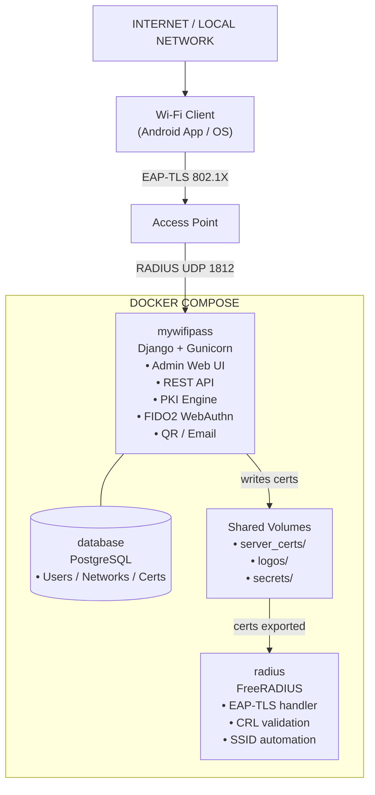
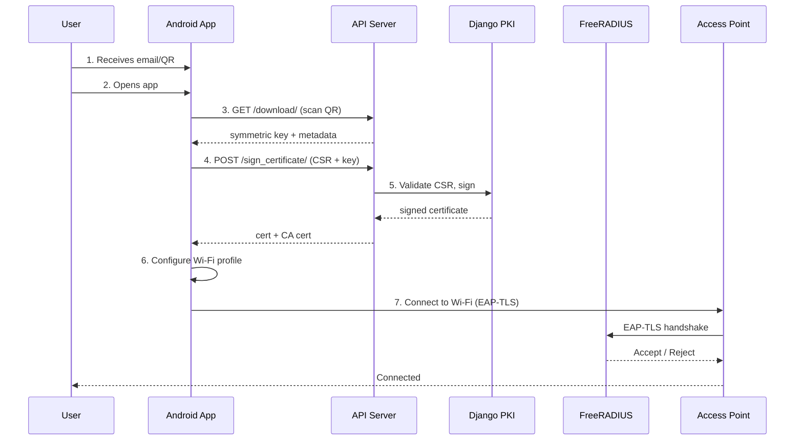
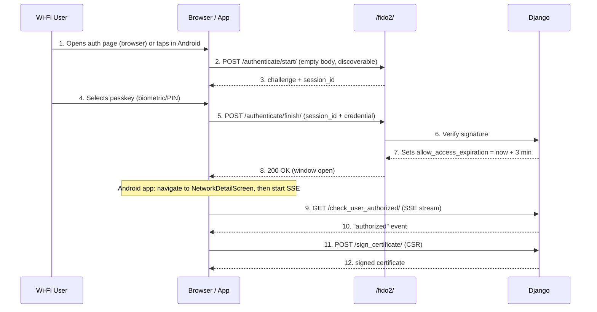
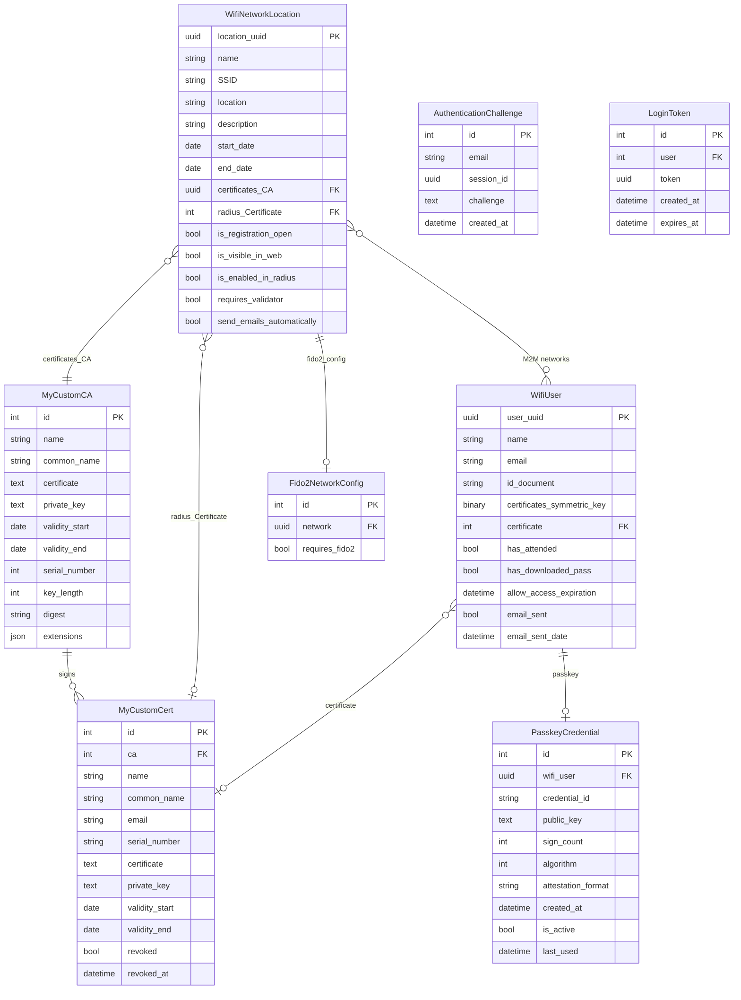

# System Architecture

## Component Overview

The system is deployed as three Docker services communicating over an internal network (`172.19.0.0/16`):



### Service Details

| Service | Image / Build | Port | Role |
|---|---|---|---|
| `mywifipass` | `python:3.13-slim-bullseye` (custom Dockerfile) | `${WEBAPP_PORT}:8000` | Django web app + REST API + PKI engine |
| `radius` | `freeradius/freeradius-server:latest` (custom Dockerfile) | `${RADIUS_PORT}:1812/udp` | EAP-TLS authentication server |
| `database` | `postgres:15` | Internal only | Data persistence |

The `mywifipass` container depends on `database` being healthy (verified via `pg_isready`).

---

## EAP-TLS Authentication Flow



### Key Steps

1. **Wi-Fi Pass Delivery** - User receives an email with a unique download URL and QR code. The URL encodes the user's UUID. The 32-byte symmetric key is returned by the download endpoint, not embedded in the URL.

2. **Wi-Fi Pass Download** - The Android app scans the QR from the user's email, which encodes a redirect URL to `GET /api/networks/{uuid}/users/{uuid}/download/`. The response includes the network metadata and the user's 32-byte symmetric key (`certificates_symmetric_key`), which acts as a shared secret to authenticate the CSR signing request.

3. **CSR Signing** - The app generates an RSA-2048 keypair using the standard JCE `KeyPairGenerator` and sends a Certificate Signing Request (CSR) to `POST /sign_certificate/`. The server validates:
   - The symmetric key (passed as the request token) matches the user's stored key
   - The CSR is in valid PEM format and properly self-signed
   - The Common Name (CN) in the CSR matches the user's name or email
   - The user is assigned to the requested network

   If `requires_validator = True`, the app uses the `check_user_authorized` SSE stream to wait for the authorization window to open before calling this endpoint. The authorization window is not enforced server-side in `sign_certificate` itself.

4. **EAP-TLS Handshake** - The Android device presents its client certificate to the access point, which forwards it to FreeRADIUS. FreeRADIUS verifies the certificate chain against the CA and checks the CRL.

---

## FIDO2 Authorization Flow (Optional Per-Network)

When `requires_validator = True` on a network, users need a **3-minute authorization window** before they can sign a CSR. This window is opened by the user authenticating with their own registered passkey:



### Two FIDO2 Modes

1. **Discoverable Mode (default)** - No email needed. The browser/Android Credential Manager presents all available passkeys for the domain. The user picks their passkey and authenticates. The credential ID maps directly to the stored `PasskeyCredential`, opening that user's CSR window.

2. **Email Mode (API-only)** - The user provides their own email in the `start` request. The server looks up their associated passkey and creates the challenge keyed by email. Not exposed in the browser UI.

---

## RADIUS File-System Integration

Django does not communicate with FreeRADIUS over the network for configuration. Instead, they share a **Docker volume** (`shared-certs`). A background `watch_ssids.sh` process (inotify) in the RADIUS container detects new files and immediately triggers `process_ssids.sh`. A periodic cron job handles automatic CRL refresh.

```
shared-certs/:
├── pending/       # Django writes new SSID certs here → process_ssids.sh adds them
├── processed/     # SSIDs already active in FreeRADIUS (moved from pending/)
├── deletion/      # Markers for SSIDs to remove → remove_ssids.sh deletes them
├── update_crl/    # Markers for CRL regeneration → update_crl.sh refreshes
└── logs/          # Per-SSID log files from shell scripts
```

| Directory | Writer | Reader | Action |
|---|---|---|---|
| `pending/` | Django (on network save) | `watch_ssids.sh` → `process_ssids.sh` | Creates RADIUS virtual server config, copies certs |
| `deletion/` | Django (on network delete/disable) | `watch_ssids.sh` → `process_ssids.sh` | Removes virtual server config and certs |
| `update_crl/` | Django (on certificate revocation) | `watch_ssids.sh` → `process_ssids.sh` | Regenerates Certificate Revocation Lists |

When `process_ssids.sh` makes changes it sends `pkill` to FreeRADIUS, restarting it to pick up the new configuration. `automatic_crl_update.sh` runs every 12 hours via cron as a safety net for all active SSIDs.

---

## Database Schema (Simplified)



---

## Data Flow Summary

1. **Admin creates a network** → Django generates a CA certificate, exports server certificates to `shared-certs/pending/` → `watch_ssids.sh` (inotify) detects the new files and triggers `process_ssids.sh`, which creates the virtual server and enables EAP-TLS for that SSID.

2. **Admin creates/imports users** → Django assigns them to networks. If `send_emails_automatically = True`, the system sends an email with a Wi-Fi pass (download URL + QR code). The 32-byte symmetric key is returned by the `/download/` endpoint when the user first opens the URL, not embedded in the email.

3. **User opens the Android app** → Scans the QR from their email (encodes the download URL) → Downloads Wi-Fi pass data including symmetric key → Optionally performs FIDO2 if required → Generates a keypair and CSR → Sends CSR to `POST /sign_certificate/` with symmetric key → Receives signed client certificate + CA certificate → Configures Wi-Fi profile.

4. **User connects to Wi-Fi** → Access point forwards EAP-TLS to FreeRADIUS → RADIUS validates client cert against the CA and CRL → Access granted or denied.

5. **Admin revokes a certificate** → Django marks `revoked = True` → Creates a marker in `shared-certs/update_crl/` → `watch_ssids.sh` triggers `process_ssids.sh` → CRL regenerated → Future EAP-TLS attempts with that certificate are rejected.
