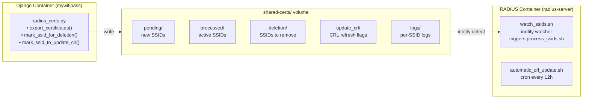
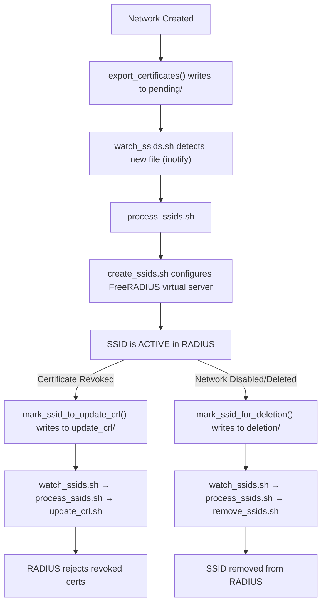

# RADIUS Integration

MyWifiPass communicates with FreeRADIUS through a **file-system-based integration** over a shared Docker volume, rather than over the network. This design avoids tight coupling and allows FreeRADIUS to operate independently.

---

## Architecture Overview



---

## Directory Structure in `shared-certs/`

| Directory | Writer | Reader | Purpose |
|---|---|---|---|
| `pending/` | Django | `watch_ssids.sh` → `process_ssids.sh` (inotify) | New SSID certs to add to FreeRADIUS |
| `processed/` | `process_ssids.sh` | (archive) | SSIDs already configured in FreeRADIUS |
| `deletion/` | Django | `watch_ssids.sh` → `process_ssids.sh` (inotify) | Marker files for SSIDs to remove |
| `update_crl/` | Django | `watch_ssids.sh` → `process_ssids.sh` (inotify) | Marker files for CRL regeneration |
| `logs/` | Shell scripts | Admin | Per-SSID log files for debugging |

---

## Django Side: `radius_certs.py`

Located at `mywifipass/mywifipass/radius/radius_certs.py`.

### `export_certificates(wifiLocation)`

Triggered when a network is created or updated (if `is_enabled_in_radius = True`).

1. Creates `pending/`, `processed/` directories if needed
2. Creates a subdirectory named after the SSID (spaces replaced with underscores)
3. Generates a RADIUS server certificate signed by the network's CA
4. Writes four files:
   - `server.pem` - Server certificate for FreeRADIUS EAP-TLS
   - `server.key` - Private key for the server certificate
   - `ca.pem` - CA certificate (client trust anchor)
   - `crl.pem` - Certificate Revocation List (current state)
5. Assigns the generated certificate to `wifiLocation.radius_Certificate`

### `mark_ssid_for_deletion(wifiLocation)`

Triggered when a network is deleted or disabled.

1. Creates a marker file in `deletion/` named after the SSID
2. Revokes the RADIUS server certificate
3. Sets `radius_Certificate = None`

### `mark_ssid_to_update_crl(wifiLocation)`

Triggered when a user certificate is revoked.

1. Creates a marker file in `update_crl/` named after the SSID
2. The file contains the SSID name

---

## RADIUS Side: Shell Scripts

Located at `our_radius/config/`.

### `watch_ssids.sh` (background inotify watcher)

Runs permanently in the background (started by the container's CMD). Uses `inotifywait` to detect file creation events in `pending/`, `deletion/`, and `update_crl/`. On any change it immediately calls `process_ssids.sh`. This gives near-instant RADIUS reconfiguration when Django exports a new SSID.

### `process_ssids.sh` (triggered by `watch_ssids.sh`)

The main orchestration script. Performs three actions in sequence:

#### 1. Process New SSIDs (`pending/`)

For each directory in `pending/`:
1. Verifies `server.pem`, `server.key`, and `ca.pem` exist
2. Creates the destination directory structure in `server_certs/<SSID>/`
3. Copies certificates to the destination
4. Copies the CA certificate to `ca/` subdirectory and runs `c_rehash` (FreeRADIUS requirement)
5. Calls `create_ssids.sh <SSID>` to add the virtual server configuration
6. Moves the directory from `pending/` to `processed/`

#### 2. Process Deletions (`deletion/`)

For each marker file in `deletion/`:
1. Removes the corresponding SSID directory from `server_certs/`
2. Calls `remove_ssids.sh <SSID>` to remove the virtual server configuration
3. Deletes the marker file

#### 3. Process CRL Updates (`update_crl/`)

For each marker file in `update_crl/`:
1. Calls `update_crl.sh <SSID>` to regenerate the CRL
2. Deletes the marker file

#### 4. Reload FreeRADIUS

If any changes were made (`CHANGES=1`), sends `pkill` to the FreeRADIUS process, causing the container to restart and pick up the new configuration.

### `create_ssids.sh`

- Source: `/usr/local/bin/create_ssids.sh`
- Reads `eap-template` and `server-template`
- Generates `mods-enabled/eap-<SSID>` with EAP configuration
- Generates `sites-enabled/<SSID>` virtual server
- Configures the RADIUS client (access point) from `clients.conf.template`

### `remove_ssids.sh`

- Source: `/usr/local/bin/remove_ssids.sh`
- Removes `mods-enabled/eap-<SSID>`
- Removes `sites-enabled/<SSID>`
- Removes the `clients.conf` entry for the SSID

### `update_crl.sh`

- Source: `/usr/local/bin/update_crl.sh`
- Regenerates the CRL file in the SSID's `ca/` directory
- Runs `c_rehash` on the CA directory

### `automatic_crl_update.sh` (cron, every 12 hours)

- Iterates all active SSIDs and calls `update_crl.sh` for each one
- Sends `pkill` to FreeRADIUS after updating so OpenSSL reloads the CRL from disk
- Runs via the container's cron (`/etc/cron.d/cron`); the only script triggered by cron rather than inotify

---

## Certificate Lifecycle in RADIUS



---

## Volume Configuration

Defined in `docker-compose.yaml`:

```yaml
services:
  mywifipass:
    volumes:
      - shared-certs:/djangox509/mywifipass/server_certs

  radius:
    volumes:
      - shared-certs:/etc/raddb/server_certs

volumes:
  shared-certs:
```

The `RADIUS_CERT_DIR` environment variable (if set) overrides the default path on the Django side.

---

## RADIUS Secret

The shared secret between the access point and FreeRADIUS is stored in:

```
our_radius/RADIUS_SECRET/secret.txt
```

This file is mounted into the RADIUS container at `/etc/raddb/secret/`. The `clients.conf.template` references this value.

---

## FreeRADIUS Container Dockerfile

```dockerfile
# our_radius/Dockerfile
FROM freeradius/freeradius-server:latest

# Copy configuration files and scripts
COPY ./config/*.sh /usr/local/bin/
COPY ./config/eap-template /etc/raddb/mods-available/eap-template
COPY ./config/server-template /etc/raddb/sites-available/server-template
COPY ./config/clients.conf.template /etc/raddb/clients.conf.template
COPY ./config/cron /etc/cron.d/cron

# Install cron and inotify-tools (for watch_ssids.sh)
RUN apt-get update && apt-get install -y gettext cron inotify-tools \
    && chmod 600 /etc/cron.d/cron \
    && crontab /etc/cron.d/cron \
    && chmod 700 /usr/local/bin/*.sh \
    && mkdir -p /etc/raddb/server_certs/processed /etc/raddb/server_certs/pending \
                /etc/raddb/server_certs/deletion /etc/raddb/server_certs/update_crl

# CMD: generates RADIUS secret, substitutes env vars into clients.conf,
#      starts cron, launches watch_ssids.sh in background, then runs FreeRADIUS
CMD /usr/local/bin/docker-entrypoint.sh && \
    export RADIUS_SECRET=$(cat /etc/raddb/secret/secret.txt) && \
    envsubst < /etc/raddb/clients.conf.template > /etc/raddb/clients.conf && \
    cron && \
    sh -c '/usr/local/bin/watch_ssids.sh &' && \
    freeradius -X
```

---

## Debugging RADIUS

### Check Shared Volume Contents

```bash
# From host
docker compose exec radius ls -la /etc/raddb/server_certs/
docker compose exec radius ls -la /etc/raddb/server_certs/pending/
docker compose exec radius ls -la /etc/raddb/server_certs/processed/

# Check deletion markers
docker compose exec radius ls -la /etc/raddb/server_certs/deletion/

# Check logs
docker compose exec radius cat /etc/raddb/server_certs/logs/<SSID>.log
```

### Check RADIUS Configuration

```bash
# List configured virtual servers
docker compose exec radius ls -la /etc/raddb/sites-enabled/

# List EAP modules
docker compose exec radius ls -la /etc/raddb/mods-enabled/eap*
```

### Test RADIUS Authentication

```bash
# From the host, using radtest (if available)
radtest testuser testpass localhost:1812 0 testing123

# Or using a simple UDP test
echo "Testing" | nc -u -w1 localhost 1812
```

### Common Issues

1. **Certificates not exported:** Check Django logs for errors during network save
2. **RADIUS not picking up certs:** Verify the inotify watcher is running: `docker compose exec radius pgrep -f watch_ssids`
3. **Permission issues:** Shared volume permissions should allow the `freerad` user to read
4. **CRL not updating:** Check `update_crl/` marker files exist after revocation

---

## Next Steps

1. **[Architecture](architecture.md)** - See how RADIUS fits in the big picture
2. **[Configuration](configuration.md)** - RADIUS-related environment variables
3. **[Troubleshooting](troubleshooting.md)** - RADIUS authentication issues
