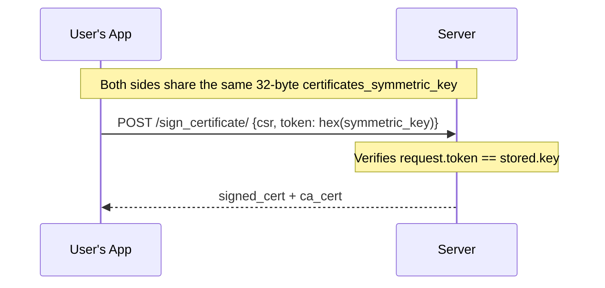

# Security Model

This document describes the security architecture of the MyWifiPass System, including certificate lifecycle management, authentication mechanisms, and threat mitigation strategies.

---

## Certificate Lifecycle Security

### Generation

- CAs and certificates use **2048-bit RSA keys** with **SHA-256** digest (configurable in `django_x509/settings.py`)
- CA private keys are stored in the database as **PEM-encoded strings** (encrypted at rest by PostgreSQL if configured)
- The RADIUS server certificate private key is written to disk (`server.key`) for FreeRADIUS to use
- User certificates are generated **on the server** (for auto-created certs) or signed from a client-provided **CSR** (for the Android flow)

### Symmetric Key Protection

Each `WifiUser` has a **32-byte random symmetric key** (`certificates_symmetric_key`) generated by `secrets.token_bytes(32)`. This key serves as a **shared secret** between the user and the server:

1. The key is included in the Wi-Fi pass (download JSON + email)
2. To sign a CSR, the Android app must provide this key as the `token` parameter
3. The server compares the provided token against the stored key: `token != user_key`



**Security properties:**
- Without the symmetric key, an attacker cannot request a certificate, even if they know the user's UUID
- The key is transmitted only once (in the Wi-Fi pass email/download)
- The key is required even if the API endpoint is technically "public" (no auth required)

### CSR Validation (`WifiUser.sign_csr`)

When the Android app sends a Certificate Signing Request, the server performs multiple validations:

1. **Token check:** The `token` (hex-encoded) in the request must match the user's stored `certificates_symmetric_key` (checked in the view, before `sign_csr`)
2. **Format validation:** PEM format check, size limit (10 KB max, DoS prevention)
3. **Cryptographic validation:** The CSR's self-signature is verified (`csr.verify(csr.get_pubkey())`)
4. **Identity validation:** The Common Name (CN) in the CSR must match either the user's name or email
5. **Assignment check:** User must be assigned to the requested network

Note: `allow_access_expiration` is **not** checked server-side in `sign_certificate`. Authorization enforcement is done at the client level: the Android app uses the `check_user_authorized` SSE stream to wait for the window to open, and only then calls `sign_certificate`. A client that bypasses the SSE flow can call the endpoint regardless of authorization status.

### Revocation

When a certificate is revoked (`cert.revoke()`):

1. The `revoked` field is set to `True` with a timestamp
2. `mark_ssid_to_update_crl()` is called for each assigned network
3. A marker file is created in `shared-certs/update_crl/`
4. `watch_ssids.sh` (inotify) detects the marker file and triggers `process_ssids.sh`, which regenerates the CRL and reloads FreeRADIUS
5. The CRL is accessible publicly at `GET /api/networks/{uuid}/crl/`

### CRL Distribution Points

Every CA embeds a CRL Distribution Point URL in the certificates it signs:

```python
crl_dp = 'URI:' + crl_url(network)
# Example: 'URI:http://wifi.example.com/api/networks/<uuid>/crl/'
```

FreeRADIUS can use this to fetch the latest CRL.

---

## Authentication Security

### API Authentication

| Method | Mechanism | Use Case |
|---|---|---|
| Token Authentication | DRF `TokenAuthentication` | Android app, programmatic API access |
| Session Authentication | Django session + CSRF token | Browser-based admin access |
| QR Token | `LoginToken` (UUID, 5-min expiry) | Admin app login via QR scan |

### QR Token Security

- Generated only for authenticated admin users at `/admin/qr/`
- Expires in **5 minutes** (`LoginToken.expires_at`)
- Expired tokens are cleaned up:
  - **Opportunistically:** when a new QR is generated at `/admin/qr/` (view deletes all currently-expired tokens) and when a new token is created (via `post_save` signal, which deletes tokens expired more than 1 hour ago)
  - **Periodically:** via `manage.py cleanup_expired_tokens` (recommended as a cron job)
- Tokens are UUIDs (`uuid4`) - 122 bits of entropy, not guessable

### Rate Limiting

Protects against brute-force and DoS attacks:

| Endpoint | Limit | Rationale |
|---|---|---|
| Login | 5/min per IP | Prevent brute-force on credentials |
| CSR signing | 3/min per user | Computationally expensive operation |
| Authorization | 10/min per user | Prevent flooding the authorization endpoint |
| Download | 20/min per IP | Prevent abuse of Wi-Fi pass downloads |
| Validation | 10/min per IP | Prevent enumeration attacks |

---

## Email Security

### SMTP Header Injection Prevention

The `WifiUserForm` validates email fields against header injection:

```python
def validate_email_header_injection(email: str):
    suspicious_chars = ['\n', '\r', '\t', '%0a', '%0d']
    # Rejects emails with header injection patterns
    if re.search(r'(?:bcc|cc|subject|to):', email, re.IGNORECASE):
        raise ValidationError(...)
```

### Email Sending

- Emails are sent via **Django's SMTP backend** with TLS enabled
- The `EMAIL_TIMEOUT` is set to 5 seconds to prevent hanging
- Emails are sent from a **background thread** (`threading.Thread`) to avoid blocking HTTP responses
- A **fallback mechanism** uses Django's `EmailMultiAlternatives` if raw MIME send fails

---

## FIDO2 / WebAuthn Security

### Challenge Management

- **Authentication challenges** are stored in the **database** (`AuthenticationChallenge` model), not HTTP sessions - this supports **multi-worker Gunicorn** deployments where session-based storage would fail
- **Registration challenges** are stored in the **HTTP session** (only used from a browser, single request context)
- Stale authentication challenges (>5 minutes) are purged at the start of each new request

### Replay Detection

- `sign_count` is stored and incremented on each successful authentication
- The WebAuthn library verifies the new `sign_count` > stored `sign_count`

### Origin Validation

- The WebAuthn library validates the origin against `EXPECTED_ORIGINS`
- Only web origins matching the configured domain and Android app key hashes are accepted
- This prevents phishing attacks from malicious domains

### User Verification

- **Registration:** `userVerification` is set to `"required"` in the JSON sent to the client
- **Authentication:** `userVerification` is set to `"preferred"` in the JSON sent to the client - this is a deliberate choice for Android Credential Manager compatibility; the server-side `webauthn` library still initialises with `REQUIRED` internally
- In practice, the authenticator always performs user verification (biometric, PIN, etc.) because passkeys registered with `resident_key=REQUIRED` enforce it

### Time-Limited Authorization

- After successful FIDO2 authentication, `allow_access_expiration = now + 3 minutes`
- The CSR window is strictly time-limited
- After the window expires, a new FIDO2 authentication is required
- The `deauthorize()` method clears the window and sets `has_attended = True`

---

## Web Application Security

### Django Security Middleware

All standard Django security middleware is enabled:

```python
MIDDLEWARE = [
    'django.middleware.security.SecurityMiddleware',
    'django.contrib.sessions.middleware.SessionMiddleware',
    'django.middleware.common.CommonMiddleware',
    'django.middleware.csrf.CsrfViewMiddleware',
    'django.contrib.auth.middleware.AuthenticationMiddleware',
    'django.contrib.messages.middleware.MessageMiddleware',
    'django.middleware.clickjacking.XFrameOptionsMiddleware',
]
```

### CSRF Protection

- Session-based API access is protected by Django's `CsrfViewMiddleware`
- Token-based API access is **exempt** from CSRF (by design - stateless APIs don't need CSRF)
- `CSRF_TRUSTED_ORIGINS` is automatically populated from `ALLOWED_HOSTS` and SSL settings

### SSL / HTTPS

When `SSL=True` in `.env`:

```python
SESSION_COOKIE_SECURE = True    # Cookies only sent over HTTPS
CSRF_COOKIE_SECURE = True       # CSRF token only sent over HTTPS
SECURE_SSL_REDIRECT = True      # HTTP requests redirected to HTTPS
```

### Allowed Hosts

`ALLOWED_HOSTS` is built from:
- The comma-separated `ALLOWED_HOSTS` env var
- `DOMAIN` (auto-added)
- `SERVER_IP` (auto-added)
- `testserver` (always included for Django tests)

---

## Database Security

- PostgreSQL is **not exposed externally** (internal Docker network only)
- Database credentials are configured via `.env`, never committed to git
- The Django `SECRET_KEY` is stored in a file with `chmod 600` permissions

---

## File System Security

- `secrets/.env` is validated for secure permissions (0600 or 0400)
- RADIUS certificates are written to a shared Docker volume, not exposed externally
- The `logos/` media directory is only writable by the Django container

---

## Threat Mitigation Summary

| Threat | Mitigation |
|---|---|
| Brute-force login | Rate limiting (5/min per IP), token expiry (5 min) |
| DoS via CSR signing | Rate limiting (3/min per user), size limit (10 KB), computationally bounded |
| CSRF on API | Token auth is stateless (CSRF-exempt by design); session auth uses Django CSRF middleware |
| CSRF on admin | Django `CsrfViewMiddleware` + `CSRF_TRUSTED_ORIGINS` |
| Certificate forgery | CSR signature verification, CN matching, symmetric key verification |
| Phishing (WebAuthn) | Origin validation against whitelisted origins |
| Replay (WebAuthn) | Signature counter verification |
| SMTP header injection | Email field validation rejecting newlines, CR, Bcc/Cc patterns |
| Session hijacking | `SESSION_COOKIE_SECURE`, `CSRF_COOKIE_SECURE` (in production with SSL) |
| Information disclosure | Email validation errors are generic (user existence not leaked) |
| Expired token abuse | Opportunistic + periodic cleanup of `LoginToken` entries |

---

## Next Steps

1. **[Architecture](architecture.md)** - See how security fits in the system design
2. **[FIDO2 Guide](fido2-guide.md)** - Detailed passkey security flow
3. **[Troubleshooting](troubleshooting.md)** - Security-related issues
